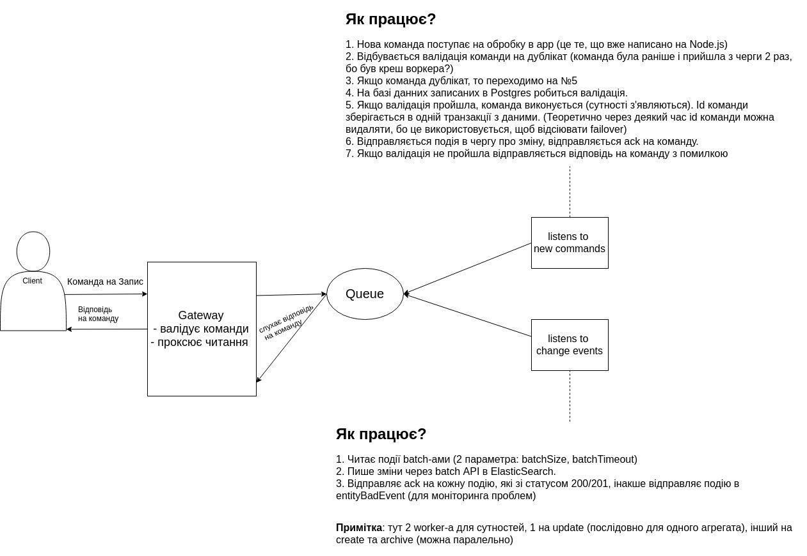

# distributed-postgres-elastic-rabbit

Synchronization between postgres and elasticsearchvia rabbit queues2

## Requirements

```sh
$ docker --version
Docker version 19.03.1-ce, build 74b1e89e8a
$ docker-compose --version
docker-compose version 1.24.1, build unknown
$ node -v
v10.15.1 # latest LTS
```

## Run

```sh
git clone git@github.com:stalniy/distributed-postgres-elastic-rabbit.git
cd distributed-postgres-elastic-rabbit
npm ci
docker-compose up
```

## How it works


